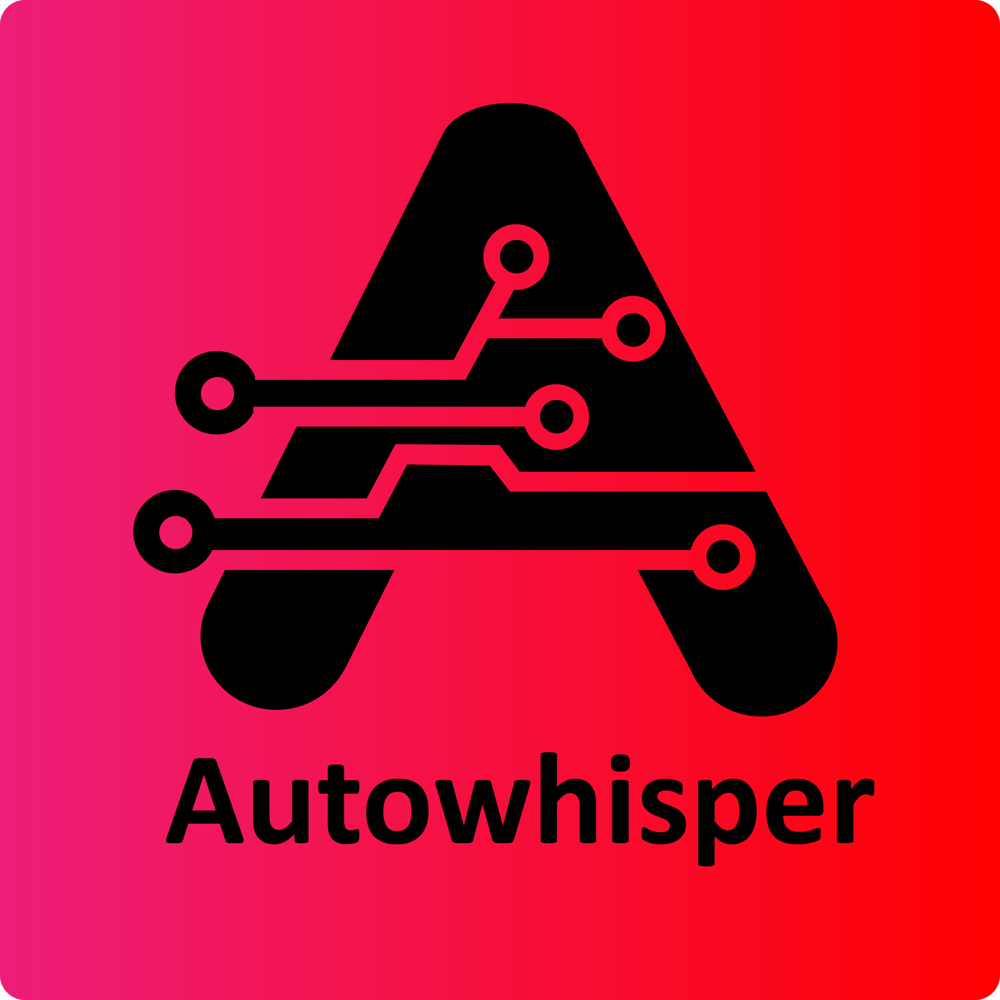

[](https://github.com/dno-ontwikkeling/AutoWhisper/releases/latest)
[](https://github.com/dno-ontwikkeling/AutoWhisper/releases)

A Windows system tray application for voice-to-text dictation. Hold a hotkey, speak, and the transcribed text is automatically pasted at your cursor position — in any application.

All processing happens locally using OpenAI's Whisper model. No cloud services, no API keys, no data leaves your machine.

## Features

- **Hold-to-record dictation** — press and hold a configurable hotkey (default: Ctrl+Shift+Space), speak, release to transcribe and paste
- **Fully offline** — Whisper runs locally, audio is processed in-memory only
- **GPU acceleration** — auto-detects CUDA (NVIDIA) and Vulkan (AMD/Intel/NVIDIA) with CPU fallback
- **Multiple models** — 5 multilingual Whisper model sizes from Tiny (39 MB) to Large v3 (3.1 GB)
- **In-app model download** — download models directly from Hugging Face with progress tracking and cancellation
- **Automatic model fallback** — if the selected model is missing, falls back to any available downloaded model
- **28 languages** — auto-detection or manual language selection
- **System tray** — runs silently in the background with single-instance enforcement
- **Visual overlay** — animated recording indicator with elapsed time, shown at the top-center of the screen
- **Interactive hotkey capture** — click "Change" in settings and press any key combo to set a new hotkey
- **Clipboard preservation** — previous clipboard contents are restored after pasting
- **Launch at startup** — optional Windows startup integration via settings

## Getting Started

### Prerequisites

**To run (installer):**
- Windows 10 or 11
- Optional: NVIDIA GPU drivers for CUDA acceleration, or up-to-date GPU drivers for Vulkan acceleration

**To build from source:**
- .NET 10 SDK

### Build and Run

```bash
dotnet build src/AutoWhisper/AutoWhisper.csproj -c Release
dotnet run --project src/AutoWhisper/AutoWhisper.csproj
```

### First Run

1. The settings window opens on first launch
2. Download a Whisper model (start with **Base** or **Small** for a good speed/accuracy balance)
3. Select your language and microphone
4. Configure a hotkey if the default (Ctrl+Shift+Space) doesn't suit you
5. Close settings — the app moves to the system tray

### Installer

An Inno Setup installer script (`installer.iss`) is included for building a standalone setup executable locally.

**Automated releases:** Every push to `main` with a conventional commit (`fix:`, `feat:`) triggers a GitHub Actions workflow that auto-tags the version (SemVer), builds the app, compiles the installer, and publishes it as a GitHub Release.

## Usage

1. Hold the hotkey to start recording
2. Speak into your microphone
3. Release the hotkey
4. The overlay shows transcription progress, then the text is pasted at the cursor

Recordings shorter than 500 ms are discarded automatically. Works in any application that accepts text input (editors, browsers, chat apps, etc.).

## Tech Stack

| Component | Library |
|---|---|
| Framework | .NET 10, WPF |
| UI Theme | WPF-UI 4.2 (Fluent Design) |
| Speech-to-Text | Whisper.net 1.9 |
| Audio Capture | NAudio 2.2 |
| Global Hotkeys | SharpHook 7.1 |
| Text Injection | InputSimulatorStandard |
| System Tray | Hardcodet.NotifyIcon.Wpf |

## Project Structure

```
src/AutoWhisper/
├── Program.cs                          # Entry point, single-instance mutex
├── App.xaml.cs                         # Tray icon, service wiring
├── Services/
│   ├── AudioCaptureService.cs          # Microphone recording (16kHz mono)
│   ├── HotkeyService.cs               # Global keyboard hook with interactive capture
│   ├── TranscriptionService.cs         # Whisper.net inference
│   ├── TextInjectionService.cs         # Clipboard paste with keyboard fallback
│   ├── SettingsService.cs              # JSON config persistence
│   ├── RuntimeDetectionService.cs      # GPU detection
│   ├── HotkeyDisplayHelper.cs         # Hotkey formatting for display
│   └── Logger.cs                       # File logging
├── State/
│   └── DictationStateMachine.cs        # Idle → Recording → Transcribing → Pasting
└── Views/
    ├── SettingsWindow.xaml             # Configuration UI
    └── RecordingOverlay.xaml           # Recording indicator
```

## Configuration

Settings are stored in `settings.json` next to the executable. Logs are written to `%APPDATA%\AutoWhisper\autowhisper.log`. Models are stored in the `Models/` folder next to the executable.

## Contributing

Contributions are welcome! See [CONTRIBUTING.md](CONTRIBUTING.md) for guidelines.

## Support

- **Bug reports** — use the [Bug Report](https://github.com/dno-ontwikkeling/AutoWhisper/issues/new?template=bug_report.md) issue template
- **Feature requests** — use the [Feature Request](https://github.com/dno-ontwikkeling/AutoWhisper/issues/new?template=feature_request.md) issue template
- **Questions** — open a [discussion](https://github.com/dno-ontwikkeling/AutoWhisper/issues) or issue

## License

This project is licensed under the MIT License — see [LICENSE](LICENSE) for details.
